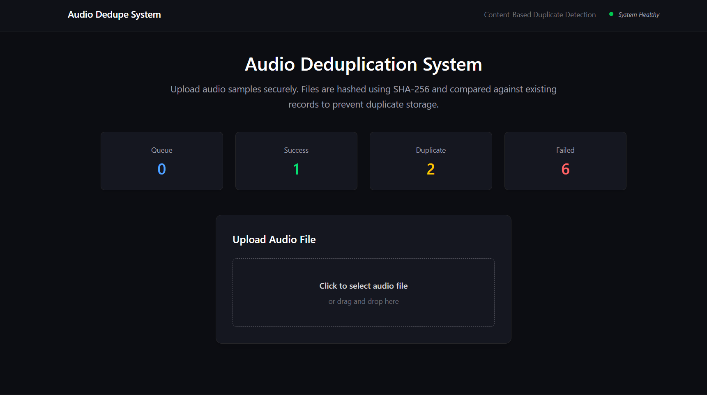

# Audio Upload Deduplication - Frontend

Next.js frontend for the audio deduplication system. Uploads files, polls job status, and displays live metrics.




## Stack

- **Framework:** Next.js (App Router)
- **Styling:** Tailwind CSS
- **HTTP Client:** Axios (centralized instance)
- **State:** Local React state + `useEffect` polling
- No external UI libraries


### `UploadCard` — State Machine

The core component. Manages the full upload lifecycle:

```
idle
  ↓  user selects file + submits
uploading  (progress bar active)
  ↓  API returns jobId
processing  (polling /jobs/:id)
  ↓  terminal state received
success | duplicate | error
  ↓  auto-reset after 4 seconds
idle
```

State variables: `status`, `message`, `progress`, `fileName`, `jobId`

No manual refresh needed — the component resets itself after showing the result.


---

## Architecture Overview

```
App Layout
     ↓
Navbar  ←  SystemStatus (polls /health every 5s)
     ↓
Hero Section
     ↓
MetricsDashboard  ←  polls /metrics every 4s
     ↓
UploadCard
   ├── FileDropzone       (drag & drop / click to select)
   ├── Job Polling        (polls /jobs/:id until terminal state)
   └── UploadStatus       (success | duplicate | failed | processing)
```

---

## API Layer (`lib/`)

All network calls go through `lib/api.js`. No raw fetch/axios calls in components.

### `lib/axios.js`
Creates a single Axios instance with `baseURL` from `NEXT_PUBLIC_API_BASE_URL` and a 15s timeout. Any future auth headers or global error interceptors go here — components don't need to change.

### `lib/api.js`
Exposes clean methods consumed by components:

```js
uploadFile(file)          // POST /upload  — returns { jobId, filename }
getJobStatus(jobId)       // GET /jobs/:id — returns { status, errorMessage, ... }
getMetrics()              // GET /metrics  — returns { jobs: {...}, queue: {...} }
checkSystemHealth()       // GET /health   — returns { status }
```

Each method returns normalized data only — no UI side-effects.

---

## Component Details

### `SystemStatus`
Calls `/health` on mount and every 5 seconds. Renders an animated ping dot in the Navbar:
- 🟢 Green — system healthy
- 🟡 Yellow — checking
- 🔴 Red — unreachable

### `MetricsDashboard`
Polls `/metrics` every 4 seconds. Renders 4 cards with color-coded counts:

| Card | Color |
|------|-------|
| Queue (waiting + active) | Blue |
| Success | Green |
| Duplicate | Yellow |
| Failed | Red |

### `FileDropzone`
Click-to-select or drag-and-drop. Accepts `.mp3`, `.wav`, `.m4a`. Single file only (matches backend assumption).

### `UploadStatus`
Renders a color-coded alert for the terminal state. Uses border + background transparency to keep it readable without being loud.

---

## Upload Flow (Step by Step)

1. User drops or selects a file
2. `uploadFile(file)` called — `POST /upload`
3. API responds with `{ jobId }` — status switches to `processing`
4. Frontend polls `GET /jobs/:id` every 2 seconds
5. On terminal status:
   - `success` → green — file stored
   - `duplicate` → yellow — file already exists
   - `failed` → red — error message shown
6. Auto-resets to idle after 4 seconds

---

## Environment Variables

```bash
NEXT_PUBLIC_API_BASE_URL=http://localhost:3000
```

---

## Setup

```bash
cd frontend
npm install
cp .env.local.example .env.local
# Set NEXT_PUBLIC_API_BASE_URL
npm run dev
```

App runs at `http://localhost:3001` (or next available port if 3000 is taken by API).

---

## Assumptions & Trade-offs

**Polling over WebSockets** — simpler and sufficient for this scale. WebSockets would be the right call for a high-frequency production system.

**No upload history** — job state lives in the backend only. The frontend forgets about a job after it resets. A history panel could be added by persisting `jobId` list in localStorage.

**Single file at a time** — matches the backend's single-job-per-request model. Parallel uploads would require a job list UI.

**No authentication** — open system. Adding auth would mean attaching a token in `lib/axios.js` interceptors — no component changes needed.